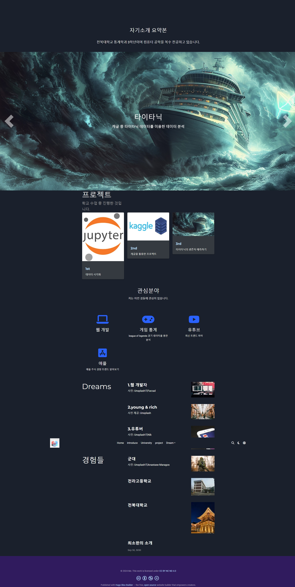

# [Hugo Portfolio Theme](https://github.com/wowchemy/starter-hugo-portfolio-theme)

전북대학교 통계학과 3학년 김우중입니다.
컴퓨터 공학을 복수 전공하고 있습니다.
관심 분야는 웹 개발, 게임 통계입니다.
웹 개발에 관심 가진 지 얼마 되지 않아, 아직 미숙합니다. 이번 학기 목표는 웹서비스 설계 수업을 통해 웹 개발에 대해 익숙해지기입니다.
